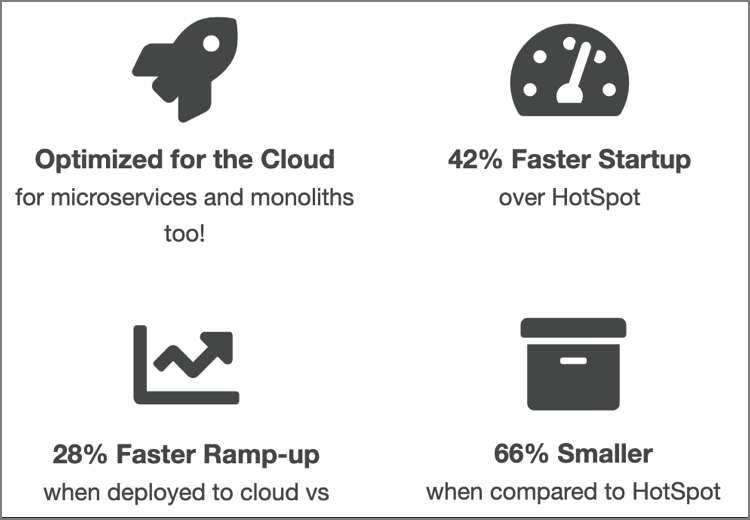

# All you need to know about the OpenJ9 JITServer

## What is OpenJ9?

`OpenJ9` is an open source JVM provided by the Eclipse Foundation, and has been available since 2017.

`OpenJ9` began life some 15 years ago as simply `J9`. Developed by IBM, `J9` has been used by all IBM Java based customers for all types of workloads - from medical, to banking and research.

As a major contributor to open source projects, IBM moved the development and governance of the `J9` JVM to the Eclipse Foundation, and re-branded the name to `OpenJ9`.

## How does it compete against other JVMs?

Optimized for the cloud and running in constrained environments, `OpenJ9` has the following advantages:

* Uses dramatically less memory without sacrificing application responsiveness.
* Provides AOT (Ahead of Time compilation) capabilities using shared cache between instances.
* Provides a remote JIT compiler (JITServer) to offload CPU cycles and memory spikes from the application instance.

And, as with other open source JVMs, it is free of charge. Pay-for-support options are also available if needed.

## What is a JITServer?

The JITServer is a unique feature offered by the OpenJ9 JVM, and provides a big performance increase, especially when dealing with constrained environments such as containers.

Instead of a typical container running a JVM with an internal JIT compiler, the JITServer is run remotely (on cloud or in its own container), where is can process compile requests from multiple JVMs. This provides the following advantages:

* JIT compilation resources can be scaled independently.
* Application containers can use smaller memory limits to minimize costs.
* Overall cluster memory savings (JITServer included) due to less memory consumption peaks coming from different applications.
* Provisioning is simpler - user only needs to care about application requirements.
* Ramp-up is faster, especially in constrained environments.
* Performance of short-lived applications is better - no need to re-compile methods on re-start.
* Performance is more predictable - less memory spikes in the JVM.
* Autoscaling behavior is better. (NEED MORE)
* JITServer ramp-up advantage increases in CPU constrained environments.

## How do I get it?

As mentioned previously, the `OpenJ9 JVM` is open source and managed by the the [Eclipse Foundation](https://www.eclipse.org/openj9/). The `JITServer` technology is included with the `OpenJ9 JVM` - in reality, the `JITServer` is just another persona instance of the `OpenJ9 JVM`.

The `OpenJ9 JVM` is available from several locations:

* From IBM, as part of the [IBM Semeru Runtimes](https://developer.ibm.com/languages/java/semeru-runtimes/downloads/).
* From [AdoptOpenJDK](https://adoptopenjdk.net/). Note that the AdoptOpenJDK project has moved to the Eclipse Foundation and will be deprecated over time. In the meantime, the link provided when selecting the `OpenJ9 JVM` will direct the user to the `IBM Semeru` download page.

As a part of the transfer of the `AdoptOpenJDK` project to the Eclipse Foundation, it will be re-branded as [Adoptium](https://adoptium.net/). Scheduled for early 2022, `Adoptium` will provide a marketplace for downloading `OpenJDK` binaries and JVMs, including `OpenJ9`. More information about this change can be found [here](https://adoptium.net/docs/faq/), and you can follow along with the release of the marketplace [here](https://github.com/adoptium/adoptium/issues/7).

## What to dig deeper?

Click here to take a deeper dive into the JITServer details.

Click here to check out a demo where we show to configure and run multiple containers with a JITServer. We will also use Grafana to graph CPU and memory metrics showing how the JITServer can better utilize and minimize system resources.

