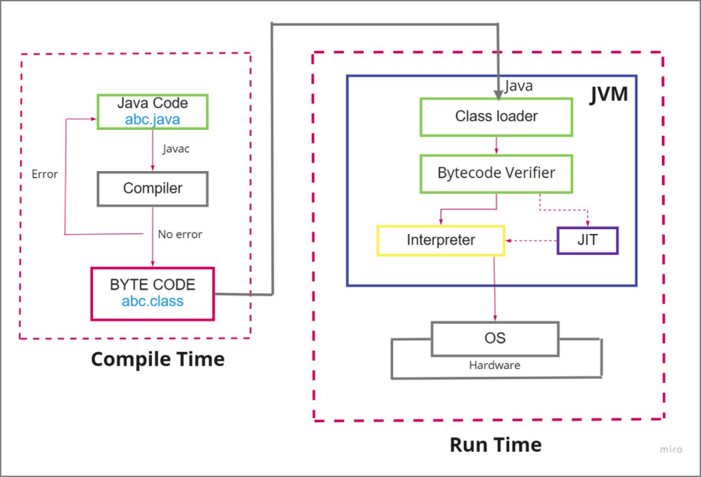
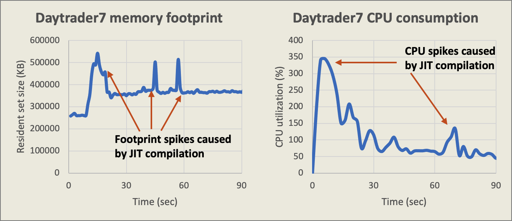
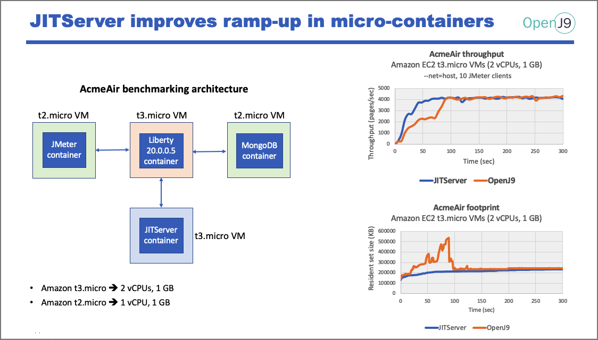
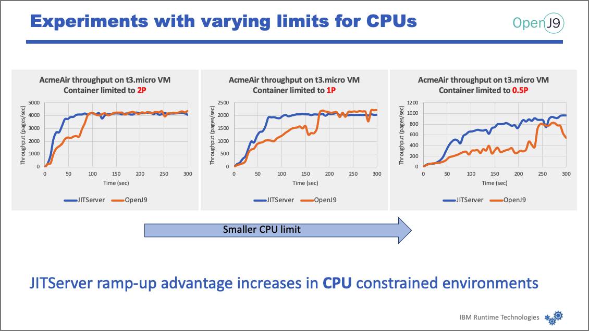
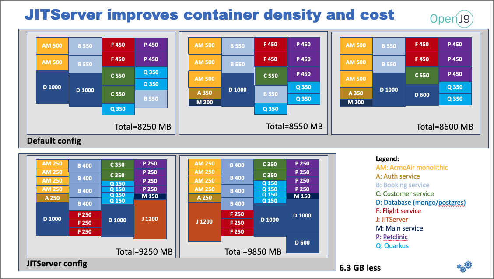
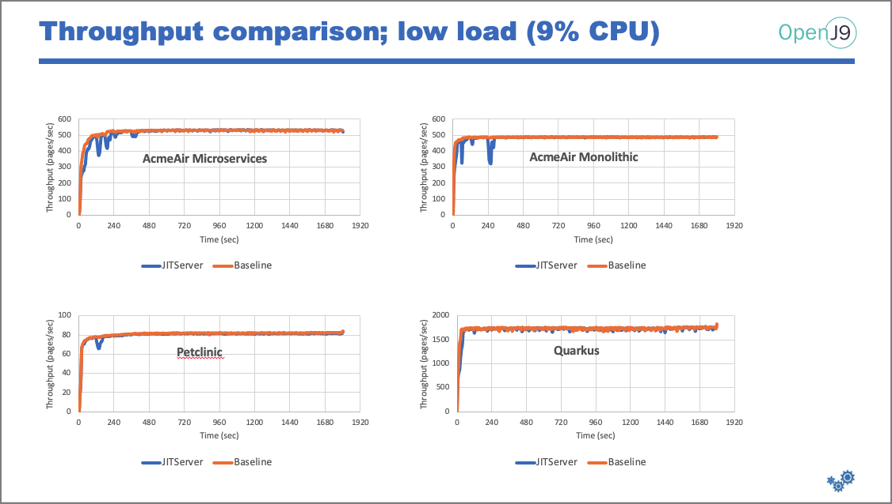

# WORK IN PROGRESS

# JITServer - optimize your Java Cloud Native applications

With the current trend to run your Java applications on the cloud, there are new challenges to ensure that application can meet your clients QoS demands. Trying to minimize container costs while also ensuring a high QoS can be a challenge. This article provides a solution to better manage your container resources.

If you target micro-containers, JITServer is the way to go (best option).

The JITServer is a feature of the OpenJ9 JVM.
The JITServer is simply another instance of the OpenJ9 JVM, with a different persona.

1. [First came the JIT compiler](#1-first-came-the-jit-compiler)
1. [JIT compilation - the good and the bad](#2-jit-compilation---the-good-and-the-bad)
1. [JITServer to the rescue](#3-jitserver-to-the-rescue)
1. [JITServer vs vanilla JIT Compiler - how they stack up](#4-jitserver-vs-vanilla-jit-compiler---how-they-stack-up)
1. [How JITServer can lower costs](#5-how-jitserver-can-lower-costs)
1. [Best use cases for implementing JITServer](#6-best-use-cases-for-implementing-jitserver)
1. [Where to get the JITServer](#7-where-to-get-the-jitserver)
1. [A working example](#8-a-working-example)

## 1. First came the JIT compiler

JIT compilers were first introduced to run Java executable code faster, to make it more competitive with natively compiled platform-specific languages.

The theory behind the JIT compiler is to convert Java bytecode to machine code as the Java bytecode is interpreted line by line. Improvement gains are realized when the "pre-compiled" Java code is executed again.

The JIT compiler is a part of the Java Virtual Machine (JVM). Shown below is the workflow from Java code to execution on the host machine:

Compile Time - converting Java code to bytecode:

- **_javac abc.java_** - invokes the java compiler that converts the java code into byte code.
- The byte code is stored in a  class file - **_abc.class_**

Run Time - execute the bytecode on the host machine:

- **_java abc_** - loads the class file byte code into the class loader of the JVM.
- The bytecode verifier ensures the security of the bytecode.
- One line at a time, the interpreter converts the bytecode into machine code and transfers it to the OS for execution.
- The JIT compiler can improve execution performance by 10x over the interpreter. Based on profiling metrics, the JIT compiler will supply machine code of recurring bytecodes to the interpreter for execution.

## 2. JIT compilation - the good and the bad

The JIT compiler provides many positives when it comes to performance:

- pre-compiled native machine code executes 10x faster than a line-by-line interpreter
- the use of a code cache optimizes efficiency
- the interpreter can execute faster (FIX)

Unfortunately, the performance gains do not come without a cost, especially in a small container environment where a premium is placed on mimimizing CPU and memory costs. Some of the negatives associated with JIT compilers include:

- Consumes more CPU cycles and memory
- Slows application start-up
- Can create memory spikes and/or OOM crashes
- Spikes and crashes lower QoS
- Added complexity of container provisioning due to factoring in worst-case scenarios
- if JIT crashes, it takes down the whole JVM

Application may only use <400MB of memory, but the JIT compiler can create spikes. To avoid OOM crashes, you will need to size your container to handle the peaks (wasteful). Need to perform a lot of experimental test runs to determine how high the spikes can be.

Container is killed and re-started. OOM Killer.

## 3. JITServer to the rescue

JITServer technology decouples the JIT compiler from the VM and lets the JIT compiler run remotely in its own process. This mechanism prevents your Java application suffering possible negative effects due to CPU and memory consumption caused by JIT compilation.

The application is not effected by the stability of the compilation - ie JIT goes down, so does the the JVM and application. If JITServer goes down, the application continues to run. The JVM retains the ability to compile locally using its JIT compiler.

Compilation occurs at the method level, not class level.

Here is an example architecture diagram of how the JITServer fits in a container environment:

Think of it as a micro-services solution applied at the JVM level. Here we split the JVM into multiple parts and communicate through the network. Kubernetes takes care of the scaling - more JITServer instances can be added or removed as needed.

This diagram shows a high-level view of the process flow between the JVM and the JITServer:

1. The bytecode is passed into the JVM.
2. The JVM checks if the method code is already stored in its local code cache.
3. If the JVM already has the compiled method code, the code is executed.
4. If the method needs to be compiled and no JITServer is running, the JVM JIT compiler is invoked. The compiled method code is then stored locally and then executed.
5. If a JITServer is running, the method is passed to the JITServer where it will check if the code is already stored in its local code cache.
6. If the JITServer does not have it stored locally, it will compile the method, store it in its local code cache, and then return the code back to the JVM.
7. If the JITServer does have the method stored locally, it simply returns it to the JVM.
8. When the JVM receives the method code from the JITServer. The method code is then stored locally and then executed.

>**NOTE**:
>1. The communication between the JVM and the JITServer typically involves multiple requests and responses. The JITServer may need additional info about the classes, profiling data, etc.
>2. Heuristics in the JVM are used to determine if the method should be compiled locally or sent to the JITServer. Some methods are very small (cheap compared to the local resources available) and are not worth sending over the network.
>3. Multiple JVMs can use the same JITServer. This is beneficial if/when multiple JVMs request the same method. If already stored in its cache, the JITServer will just return it. This takes less CPU resources and network latency is improved (no back and forth communication like normal - just one round-trip).
>4. From a developers perspective, the complexity of the JITServer is hidden.

### Benefits in a container environment

Using a JITServer in a container environment provides multiple benefits:

- JIT compilation resources can be scaled independently
- Application containers can use smaller memory limits à cost savings
- Overall cluster memory savings (JITServer included) because memory consumption peaks from different apps don’t align
- Provisioning is simpler; user only needs to care about app requirements
- Ramp-up is faster especially in constrained environments
- Performance of short-lived applications is better
- Performance is more predictable - less memory spikes in the JVM
- Autoscaling behavior is better
- Better cluster CPU utilization (including JITServer) when AOT server side caching is used
- JITServer ramp-up advantage increases in CPU constrained environments

### Where does AOT (Ahead-Of-Time compilation) fit in?

OpenJ9 has AOT capability. During first-time execution, all the methods are compiled and stored in the AOT shared class cache. Any additional JVMs that connect to the same shared class cache can take advantage of this AOT code.

With containers, AOT is not as useful. Shared class cache is embedded in the container, so when containers are destroyed, so is the shared class cache. Because of its potential short life-cycle, AOT is not a big advantage of in a container environment. Conversely, the JITServer has a long life-cycle and can continue to provide benefits.

EXPLAIN BETTER - AOT is in what container - same as JVM? If JITServer is restarted, same problem as AOT? Why is JITServer life-cycle longer?

## 4. JITServer vs vanilla JIT Compiler - how they stack up

These experiments were conducted on Amazon Elastic Compute Cloud (EC2) running on Open Liberty (middleware application server) using micro VMs. They all compare performance of using the JITServer vs just a standard OpenJ9 setup.

Here you see the ramp-up time is improved using the JITServer (most compilation occurs during ramp-up). We also see there are no spikes in memory usage (memory consumption is flat and more predictable).

NOTE: ramp-up speed is more of an issue for short-lived applications. Behavior at beginning is very important.

Here you see the effects of limiting the number of processors, starting with 2, to 1, to half.
As the CPU limit decreases, the behavior of the JITServer solution becomes more pronounced (discrepancy increases between the 2). Advantage of JITServer increases as you go into more and more CPU constrained environments

Advantage of JITServer increases as you go into more and more memory constrained environments

## 5. How JITServer can lower costs

Using Amazon EC2, to minimize cost, cheapest VMs are t3.nano and t3.micro. Both have 2 CPUs, but different amounts of memory. (CHECK CURRENT PRICES)

First graph shows, .5GB is not enough to run just OpenJ9. 200MB needed by OS, so only 300MB left for application running in container. Performance is going to be poor.

Unless you have JITServer (IS IT RUNNING IN A SIMILAR CONTAINER??)

Second graph shows attempting to solve problem with a bigger VM (micro - double the memory, and double the price). Throughput is now equal, but it winds up costing you twice as much.

DISCLAIMER - yes, these graphs do not show that additional VM is required to run the JITServer, but that is only temporary. The JITServer can be taken down once the compilations have subsided.

Experimental test bed
- ROSA (RedHat OpenShift Service on AWS)
  - Demonstrate that JITServer is not tied to IBM HW or SW
- OCP cluster: 3 master nodes, 2 infra nodes, 3 worker nodes
  - Worker nodes have 8 vCPUs and 16 GB RAM (only ~12.3 GB available)
- Four different applications
  - AcmeAir Microservices
  - AcmeAir Monolithic
  - Pet Clinic (Springboot framework)
  - Quarkus
- Low amount of load to simulate conditions seen in practice

Top graph is using vanilla OpenJ9. 3 nodes were required to hold all of the containers. Each box represents a container and lists the app and the memory requirements. The limits were determined by experiments to determine the min memory required to run without OOM issues. Boxes are scaled to indicate relative size

Bottom graph has JITServer configuration. Notice size of boxes is much smaller. Less memory required for each container. All containers fit into 2 nodes. 6.3GB less memory.

Since you pay by the node, using 33% less nodes means you save 33% in cost to manage this set of applications.

Just because you have want to maximize savings, you also need to provide the same throughput capabilities. Here we show how the applications perform under different CPU loads:

Peak throughput is the same in both configurations. Same amount of throughput but with less memory and less cost.

Key takeaways:

- JITServer can improve container density and reduce operational costs of Java applications running in the cloud by 20-30%.

- Ramp-up can be slightly affected in high density scenarios depending on the level of load and number of pods concurrently active. (ie. noisy-neighbor when CPU resources are low, and all apps want to compile at same time (ramp-up), which rarely happens in reality)

## 6. Best use cases for implementing JITServer

JITServer usage recommendations

When to use it:

- Java application is required to compile many methods in a relatively short time
- The application is running in a constrained environment with limited CPU or memory, which can worsen interference from the JIT compiler
- The network latency between JITServer and client VM is relatively low (<1ms)

How to use it:

- 10-20 client JVMs connected to a single JITServer instance
- Two smaller JITServer instances are better than a single bigger one
- JITServer needs 1-2 GB of RAM
- Use vCPU “limits” much larger than “requests” to allow for CPU usage spikes
- Better performance if the compilation phases from different JVM clients do not overlap (stagger)

## 7. Where to get the JITServer

JVM Players:

- OpenJDK - open-source supported by the Adoptium foundation. 
- HotSpot - open-source Java JVM implementation by Oracle.
- Azul Platform Core - based on OpenJDK and supported by Azul Systems.
- Eclipse OpenJ9 - open-source based on OpenJDK. Multi-platform support.
- GraalVM - based on OpenJDK/HotSpot. Multi-language support.

Comes with Eclipse OpenJ9 JVM

Azul has a Cloud Native Compiler (CNC) product that provides a very similar service as the JITServer. Released in 10/2021. Is proprietary and requires a non-disclosure license (can't publish results). NOT FOR FREE.
Their normal JVM consumes lots of resources (CPU and memory).

## 8. A working example

When the JVM is launched, it needs to specify the address of the JITServer.

Deploy app with and without JITServer on AWS w/ OpenShift
Show docker files and screenshots of important setup steps
Are there metrics to show throughput?
Create a video for this
