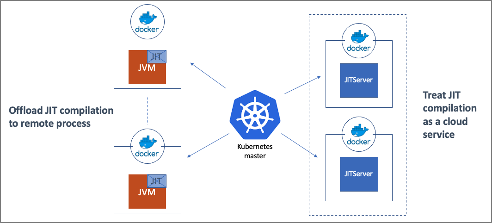
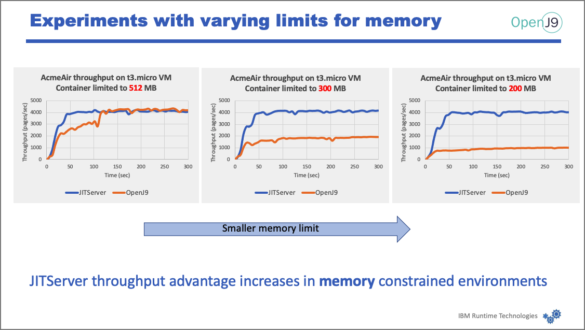
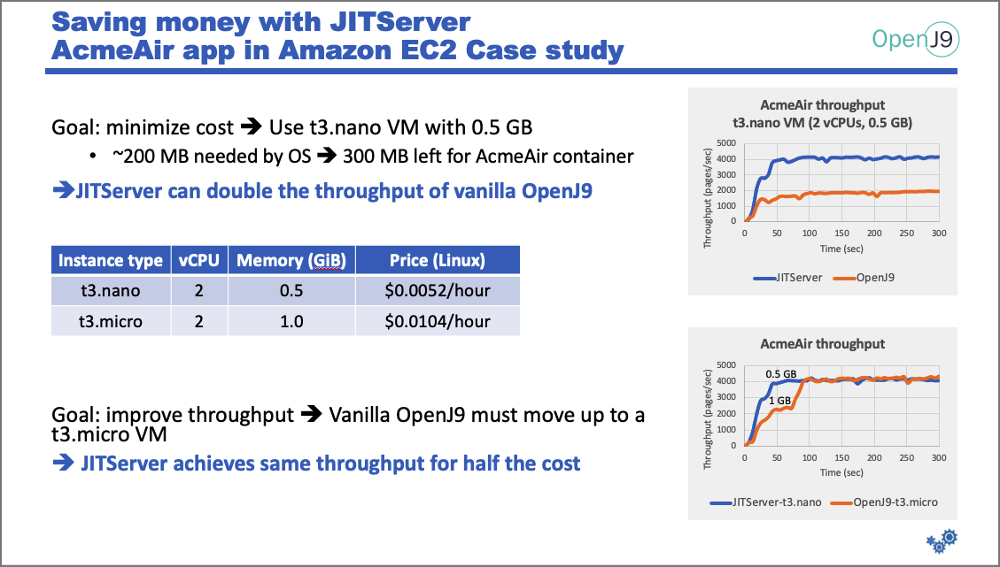
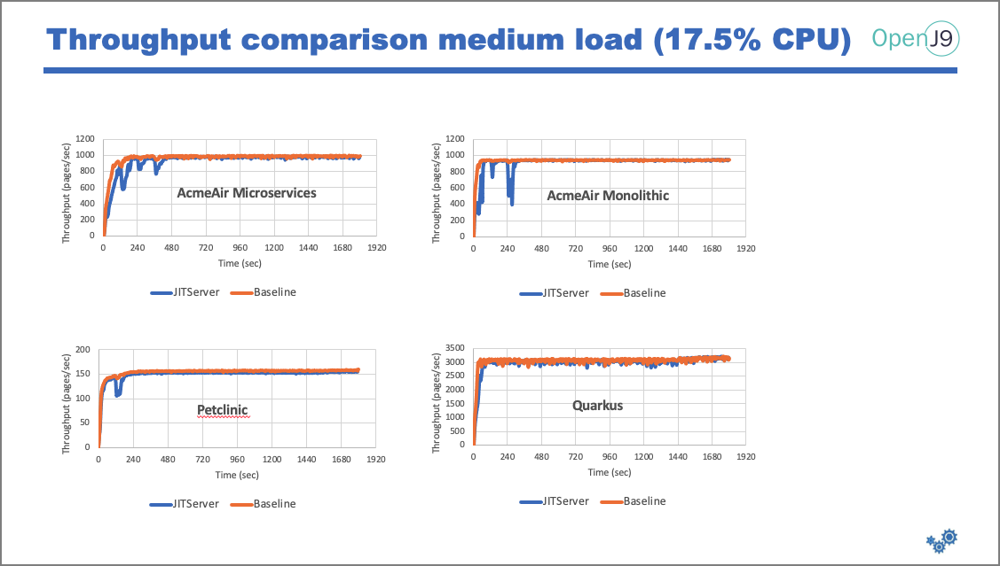

# WORK IN PROGRESS

# JITServer - optimize your Java Cloud Native applications

With the current trend of migrating applications to the cloud, a new set of challenges have emerged - namely related to performance and cost. This article proposes that the OpenJ9 JITServer is a great solution to address both of these issues.

With the use of the JITServer (included with the Eclipse OpenJ9 JVM), we describe how it is possible to ensure the high Quality of Service (QoS) that clients demand, while also lowering costs through better use of managed container resources.

In this article we will cover JIT compiler basics, how the JITServer can make a big difference in a micro-container environment, and finally a working demo that utilizes the JITServer process.

## Steps

1. [First came the JIT compiler](#1-first-came-the-jit-compiler)
1. [JIT compilation - the good and the bad](#2-jit-compilation---the-good-and-the-bad)
1. [JITServer to the rescue](#3-jitserver-to-the-rescue)
1. [JITServer vs vanilla JIT Compiler - how they stack up](#4-jitserver-vs-vanilla-jit-compiler---how-they-stack-up)
1. [How JITServer can lower costs](#5-how-jitserver-can-lower-costs)
1. [Best use cases for implementing JITServer](#6-best-use-cases-for-implementing-jitserver)
1. [Where to get the JITServer](#7-where-to-get-the-jitserver)

## 1. First came the JIT compiler

JIT compilers were first introduced to run Java executable code faster, making it more competitive with natively compiled platform-specific languages.

The theory behind the JIT compiler is to convert Java bytecode to machine code as the bytecode is interpreted line by line. Improvement gains are realized when the "pre-compiled" Java code is executed again.

The JIT compiler is a part of the Java Virtual Machine (JVM). Shown below is the workflow from Java code to execution on the host machine:

Compile Time - converting Java code to bytecode:

* **_javac abc.java_** - invokes the java compiler that converts the java code into byte code.
* The byte code is stored in a  class file - **_abc.class_**

Run Time - execute the bytecode on the host machine:

* **_java abc_** - loads the class file byte code into the class loader of the JVM.
* The bytecode verifier ensures the security of the bytecode.
* One line at a time, the interpreter converts the bytecode into machine code and transfers it to the OS for execution.
* The JIT compiler can improve execution performance by 10x over the interpreter. Based on profiling metrics, the JIT compiler will supply machine code of recurring bytecodes to the interpreter for execution.

## 2. JIT compilation - the good and the bad

The JIT compiler provides many positives when it comes to performance:

* Pre-compiled native machine code executes 10x faster than a line-by-line interpreter.
* The use of a code cache optimizes efficiency.

Unfortunately, the performance gains do not come without a cost, especially in a small container environment where a premium is placed on minimizing CPU and memory costs. Some of the negatives associated with JIT compilers include:

* Consumes more CPU cycles and memory.
* Slows application start-up.
* Can create memory spikes and/or OOM crashes.
* Spikes and crashes lower QoS.
* Added complexity of container provisioning due to factoring in worst-case scenarios.
* if JIT crashes, it takes down the whole JVM.

Here we show an example of how JIT compilation spikes effect CPU consumption and memory usage.

While this application may only use <400MB of memory, the JIT compiler can create large spikes. To avoid out of memory (OOM) crashes, the container will need to be sized to accommodate these occasional spikes. Additional experimental tests may need to be performed to determine how high the spikes can be.

Remember that in a container environment, OOM crashes will result in the container being killed and re-started.

## 3. JITServer to the rescue

JITServer technology decouples the JIT compiler from the VM and lets the JIT compiler run remotely in its own process. This mechanism prevents your Java application suffering possible negative effects due to CPU and memory consumption caused by JIT compilation - if the JIT goes down, so does the the JVM and application.

With the JITServer, the application is not effected by the stability of the compilation - if the JITServer goes down, the application continues to run. The JVM retains the ability to compile locally using its local JIT compiler.

Here is an example architecture diagram of how the JITServer fits in a container environment:

Think of it as a micro-services solution applied at the JVM level. Here we split the JVM into multiple parts and communicate through the network. Kubernetes takes care of the scaling - more JITServer instances can be added or removed as needed.

This diagram shows a high-level view of the process flow between the JVM and the JITServer:

(Need to mention that compilation occurs at the method level?)

1. The bytecode is passed into the JVM.
2. The JVM checks if the method code is already stored in its local code cache.
3. If the JVM already has the compiled method code, the code is executed.
4. If the method needs to be compiled and no JITServer is running, the JVM JIT compiler is invoked. The compiled method code is then stored locally and then executed.
5. If a JITServer is running, the method is passed to the JITServer where it will check if the code is already stored in its local code cache.
6. If the JITServer does not have it stored locally, it will compile the method, store it in its local code cache, and then return the code back to the JVM.
7. If the JITServer does have the method stored locally, it simply returns it to the JVM.
8. When the JVM receives the method code from the JITServer. The method code is then stored locally and then executed.

>**NOTE**:
>
>* The communication between the JVM and the JITServer typically involves multiple requests and responses. The JITServer may need additional info about the classes, profiling data, etc.
>* Heuristics in the JVM are used to determine if the method should be compiled locally or sent to the JITServer. Some methods are very small (cheap compared to the local resources available) and are not worth sending over the network.
>* Multiple JVMs can use the same JITServer. This is beneficial if/when multiple JVMs request the same method. If already stored in its cache, the JITServer will just return it. This takes less CPU resources and network latency is improved (no back and forth communication like normal - just one round-trip).
>* From a developers perspective, the complexity of the JITServer is hidden.

### Benefits in a container environment

Using a JITServer in a container environment provides multiple benefits:

* JIT compilation resources can be scaled independently.
* Application containers can use smaller memory limits to minimize costs.
* Overall cluster memory savings (JITServer included) because memory consumption peaks from different applications don’t align. ???
* Provisioning is simpler - user only needs to care about application requirements.
* Ramp-up is faster especially in constrained environments.
* Performance of short-lived applications is better. (WHY)
* Performance is more predictable - less memory spikes in the JVM.
* Autoscaling behavior is better. (NEED MORE)
* Better cluster CPU utilization (including JITServer) when AOT server side caching is used. ???
* JITServer ramp-up advantage increases in CPU constrained environments.

### Where does AOT (Ahead-Of-Time compilation) fit in?

OpenJ9 has AOT capability. During first-time execution, all the methods are compiled and stored in the AOT shared class cache. Any additional JVMs that connect to the same shared class cache can take advantage of this AOT code.

With containers, AOT is not as useful. Shared class cache is embedded in the container, so when containers are destroyed, so is the shared class cache. Because of its potential short life-cycle, AOT is not a big advantage of in a container environment. Conversely, the JITServer has a long life-cycle and can continue to provide benefits.

EXPLAIN BETTER - AOT is in what container - same as JVM? If JITServer is restarted, same problem as AOT? Why is JITServer life-cycle longer?

## 4. JITServer vs vanilla JIT Compiler - how they stack up

These experiments were conducted on Amazon Elastic Compute Cloud (EC2) running on Open Liberty (middleware application server) using micro VMs. They all compare the performance of using the JITServer vs non-JITServer standard OpenJ9 setup.

First we see how ramp-up time is improved using the JITServer (most compilation occurs during ramp-up). We also see there are no spikes in memory usage (memory consumption is flat and more predictable).

>**NOTE**: ramp-up speed is more of an issue for short-lived applications. Behavior at beginning is very important.

Next we see the effects of limiting the number of processors, starting with 2, to 1, to .5.
As the CPU limit decreases, the behavior of the JITServer solution becomes more pronounced (discrepancy increases between the 2). In other words, the advantage of JITServer increases as you go into more and more CPU constrained environments.

In this last graph we see that the advantage of the JITServer increases as you go into more and more memory constrained environments.

## 5. How JITServer can lower costs

To minimize cost using Amazon EC2, we will show the cheapest VMs available - the **t3.nano** and the **t3.micro** profiles. Both have 2 CPUs, but with different amounts of memory.

These graphs show how the profiles handle both a standard OpenJ9 setup and one which adds the JITServer.

The first graph shows that .5GB is not enough to run just the OpenJ9 JVM. Roughly 200MB is needed by the OS, so only around 300MB is left for the application running in container. As you can see, the performance is poor.

The second graph solves the problem by using a larger VM (the micro VM has double the memory, and double the price). The throughput is now equal, but it winds up costing you twice as much.

DISCLAIMER - these graphs do not show that additional VM is required to run the JITServer, but that is only temporary. The JITServer can be taken down once the compilations have subsided.

In this next example, we show utilizing the JITServer can lower the nodes required to support a set of applications.

This example consists of the following:

* Running on ROSA (RedHat OpenShift Service on AWS).
* The OpenShift Container Platform (OCP) consists of 3 master nodes, 2 infra nodes, and 3 worker nodes.
  * The Worker nodes have 8 vCPUs and 16 GB RAM (only ~12.3 GB available).
* Nodes will host 4 different applications:
  * AcmeAir Microservices
  * AcmeAir Monolithic
  * Pet Clinic (Springboot framework)
  * Quarkus
* A low amount of load was added to simulate real-world environments.

The top graph is using vanilla OpenJ9. Note that 3 nodes are required to hold all of the containers. Each box represents a container and lists the application and the memory requirements. The limits were determined by experiments to determine the minimum memory required to run without OOM issues. The boxes are scaled to indicate relative size.

The bottom graph has a JITServer configuration. Notice the size of boxes is much smaller which means less memory is required for each container. All the containers fit into 2 nodes, which saves 6.3GB of memory.

Since you pay by the node, using 33% less nodes means you save 33% in cost to manage this set of applications.

But just because you have want to maximize savings, you also need to provide the same throughput capabilities. Here we show how the applications perform under different CPU loads:

Peak throughput is the same in both configurations (with and without JITServer), which means we get the same amount of throughput but with less memory and less cost.

Key takeaways:

* JITServer can improve container density and reduce operational costs of Java applications running in the cloud by 20-30%.

* Ramp-up speed can be slightly affected in high density scenarios depending on the level of load and number of pods concurrently active - ie. noisy-neighbor effect occur when CPU resources are low and all applications want to compile at the same time (ramp-up), which rarely happens in reality.

## 6. Best use cases for implementing JITServer

There are trade-offs with using the JITServer. Here are the conditions where the JITServer provides the most value:

* Java application is required to compile many methods in a relatively short time.
* The application is running in a constrained environment with limited CPU or memory, which can no afford interference from the local JIT compiler.
* The network latency between JITServer and client VM is relatively low (<1ms).

How the JITServer should be implemented:

* 10-20 client JVMs connected to a single JITServer instance.
* Two smaller JITServer instances are better than a single bigger one.
* JITServer needs 1-2 GB of RAM.
* Use vCPU “limits” much larger than “requests” to allow for CPU usage spikes.
* Better performance if the compilation phases from different JVM clients do not overlap (stagger).

## 7. Where to get the JITServer

As mentioned previously, the JITServer comes with the standard [Eclipse OpenJ9 JVM](https://www.eclipse.org/openj9/). In fact, the JITServer is actually just another instance of the OpenJ9 JVM, but with a different persona.

The OpenJ9 JVM is open-source and free to download. Due to licensing issues, the only vendor that currently provides install packages and support is IBM, via the [Semeru Runtimes](https://developer.ibm.com/languages/java/semeru-runtimes/downloads/).

### Any competing technologies?

Currently, no other leading JVM vendors offer the JITServer provided by OpenJ9. But Azul does have a competing product that provides similar functionality - the product name is [Cloud Native Compiler](https://docs.azul.com/cloud_native_compiler/) (CNC). Note that the product is proprietary and requires a non-disclosure license to use.
